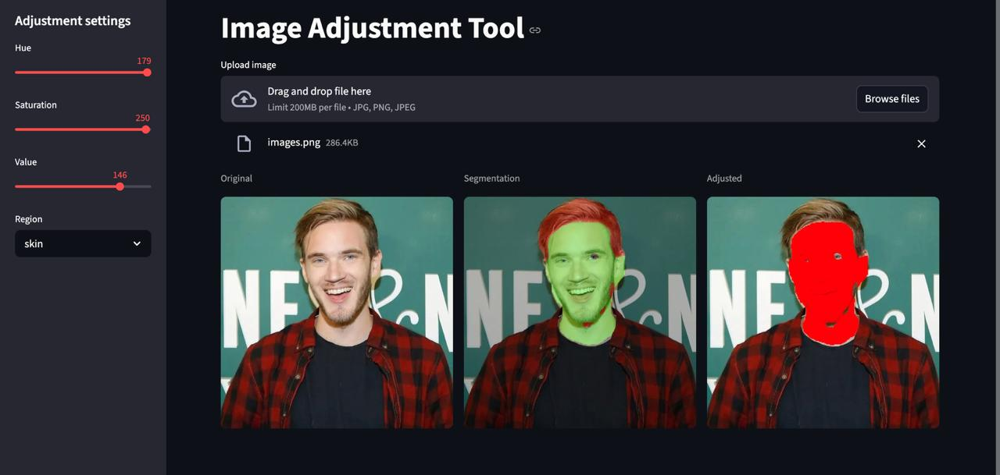

# Semantic Segmentation — Hair , Skin & Background

Segmentation of hair and skin regions in portrait photos. Three classes: background, hair, skin.

The model is trained with PyTorch (iou_score - 0.9179, fscore - 0.956), exported to ONNX, and served via a Streamlit web app with real-time HSV color adjustment per segment.

---

## Stack

- **Model**: UNet with ResNet18 encoder (`segmentation_models_pytorch`)
- **Training**: PyTorch, Dice Loss, Adam, 75 epochs
- **Inference**: ONNX Runtime — CoreML (Apple Silicon), CUDA (Nvidia), CPU fallback
- **App**: Streamlit
- **Package manager**: uv

---

## Project Structure

```
.
├── models/
│   ├── best_model_new.pt       # PyTorch JIT (training output)
│   └── best_model_new.onnx     # ONNX (inference)
├── baseline-train.ipynb        # Training notebook
├── web.py                      # Streamlit app
├── converter.py                # PyTorch JIT → ONNX export
├── Dockerfile
├── docker-compose.yml
├── pyproject.toml
└── uv.lock
```

---

## Setup

```bash
uv sync
```

---

## Training

Open and run `baseline-train.ipynb`. The notebook expects a dataset in the following structure:

```
camvid-dataset/
├── Train/
├── Trainannot/
├── Validation/
├── Validationannot/
└── label_colors.txt
```

Update `DATSET_NAME` in the notebook to point to your dataset. The best checkpoint by validation IoU is saved to `models/best_model_new.pt`.

The dataset was labeled manually using [CVAT](https://cvat.ai).

---

## Convert to ONNX

Run once after training:

```bash
uv run python converter.py
```

Exports `best_model_new.pt` → `best_model_new.onnx` and validates that outputs match within tolerance.

---

## Run the App

```bash
uv run streamlit run web.py
```

Or with Docker:

```bash
docker compose up --build
```

Upload a portrait image. The model runs once per image and caches the result — adjusting HSV sliders or switching region does not re-run inference.

The app shows three columns: original, segmentation overlay, adjusted result.

---

## How Inference Works

1. Image resized to fit 256×256 preserving aspect ratio, padded with black
2. Normalized with ImageNet mean/std
3. Passed through ONNX model → output `(1, 3, 256, 256)`
4. `argmax` over class axis → mask with values 0/1/2
5. Mask resized back to original image dimensions

---

## Model Details

| Parameter       | Value                      |
| --------------- | -------------------------- |
| Architecture    | UNet                       |
| Encoder         | ResNet18                   |
| Encoder weights | ImageNet                   |
| Input size      | 256×256                   |
| Classes         | 3 (background, hair, skin) |
| Loss            | Dice Loss                  |
| Optimizer       | Adam, lr=0.0005            |
| LR schedule     | Halved every 15 epochs     |
| Epochs          | 75                         |
| Batch size      | 16 (train), 1 (val)        |
| Metric          | IoU                        |
